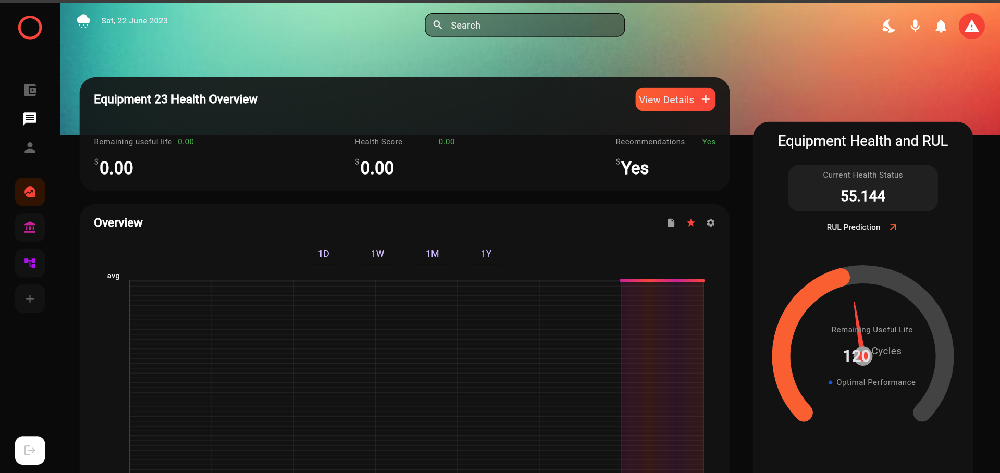

# SystemSync - Predictive Maintenance App

**SystemSync** is a predictive maintenance app designed to forecast machine failures and predict the Remaining Useful Life (RUL) of equipment. The app uses advanced machine learning algorithms and real-time data collection to improve reliability, efficiency, and equipment lifespan.

## Features

- **Predictive Maintenance**: Forecast potential failures using machine learning algorithms.
- **Remaining Useful Life (RUL)** Prediction: Calculate and visualize the remaining useful life of machines.
- **Real-time Graph Plotting**: Automated data collection and real-time graph plotting to track machine performance.
- **Live Data Collection**: Receive live data from connected machines to continuously monitor and update system status.
- **Automated Notifications**: Issue alerts and notifications to owners upon detecting potential issues or failures.

## How It Works

1. **Data Collection**: Arduino sensors capture machine data, which is then transmitted to Firebase.
2. **Backend Processing**: The backend uses advanced machine learning models to analyze data and predict failures.
3. **Real-time Visualization**: The frontend displays real-time graphs, providing insights into machine performance.
4. **Notifications**: When an issue is detected, the app sends alerts to help users take timely action.

## Technologies Used

- **Frontend**: Flutter (for a responsive and intuitive UI)
- **Backend**: Django (to handle API requests and serve as the core logic engine)
- **Machine Learning**: Implemented in Django to forecast machine failures and predict RUL
- **Data Storage**: Firebase (for real-time database and cloud storage)
- **Hardware**: Arduino (for collecting machine data and sending it to the backend)

## Installation

1. Clone the repository:
   ```bash
   git clone https://github.com/your-username/systemsync.git
   cd systemsync
## Backend Setup

1. Install Python dependencies:
   ```bash
   pip install -r requirements.txt


